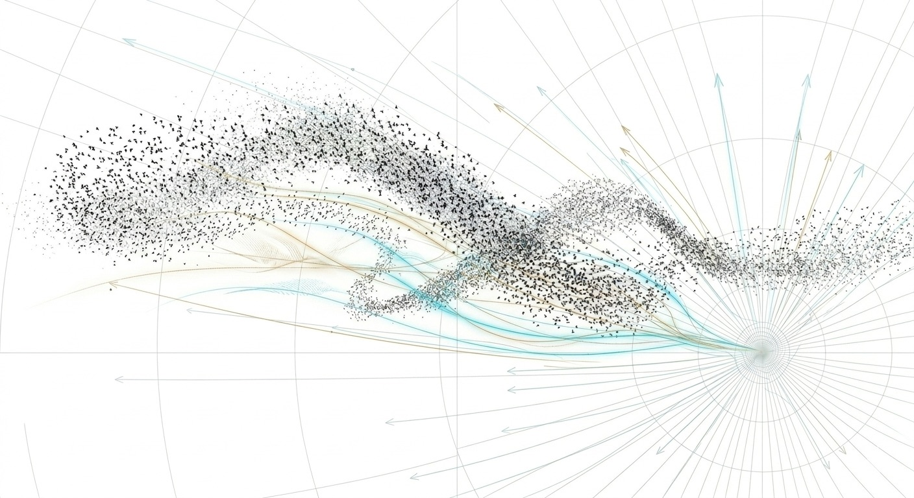

# Bird XAI
철새 군집 이동을 활용한 XAI 시각화 미디어아트

> *자연은 고정되지 않는다. AI의 판단도 마찬가지다.*



철새의 이동을 AI가 계산한다. 그 경로는 하나처럼 보이지만, 실제로는 수십 개의 가능성이 겹쳐있다.  
이 작업은 결과만이 아니라 — 풍향이 경로를 어떻게 틀었는지, 기온이 고도를 어떻게 낮췄는지 —  
AI의 판단 과정 자체를 시각적 레이어로 드러낸다.

관객은 환경 변수를 직접 조작하며 경로가 재계산되는 과정을 목격한다.  
SHAP 기여도가 실시간으로 갱신되며, AI가 왜 그 경로를 선택했는지가 수치로 드러난다.

---

## Pipeline

```
Movebank GPS  ──┐
                ├──▶  Preprocessing  ──▶  Predictor  ──▶  XAI  ──▶  Boids  ──▶  Server  ──▶  Unity
ERA5 Climate  ──┘
```

| 단계 | 처리 내용 |
|------|-----------|
| **Preprocessing** | GPS 노이즈 제거 (Kalman Filter) → 균일 경로 생성 (Cubic Spline) → ERA5 기후 데이터 시간 매핑 |
| **Predictor** | GPS + 기후 데이터 (풍속·풍향·기온·지형) 공동 학습. Monte Carlo Dropout으로 후보 경로 50개 생성 |
| **XAI** | SHAP으로 각 환경변수의 경로 선택 기여도 수치화. 프레임 단위 출력 |
| **Boids** | AI 예측 경로를 리더로 삼아 파티클 군집 시뮬레이션 (Separation · Alignment · Cohesion) |
| **Server** | FastAPI WebSocket, 30fps 스트리밍. 관객 조작 수신 → 예측 재실행 → 경로 + SHAP 갱신 |
| **Unity** | VFX Graph GPU 파티클 렌더링. 색상·밝기를 SHAP 기여도에 매핑 |

---

## Stack

**Data**  
Movebank (철새 GPS) · ERA5 / Copernicus Climate Data Store (풍향·풍속·기온)

**AI / ML**  
PyTorch · LSTM · Monte Carlo Dropout · SHAP · filterpy · scipy

**Backend**  
Python · FastAPI · WebSocket

**Rendering**  
Unity · VFX Graph

---

## Team
*컴퓨터공학 × 영상예술학*

| 역할 | 담당 |
|------|------|
| 데이터 전처리 · FastAPI WebSocket | . |
| 예측 모델 · Boids 시뮬레이션 · XAI | . |
| Unity VFX Graph · 인터랙션 | . |
| 비주얼 디자인 | 영상예술학 |

