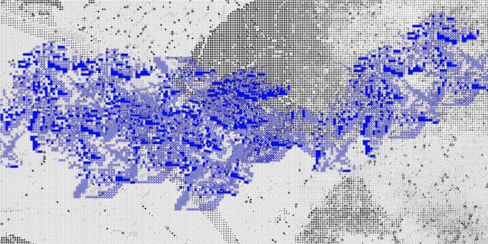

# Bird XAI
> 철새 이동 데이터 기반 XAI 인터랙티브 미디어아트 설치 작품

*자연은 고정되지 않는다. AI의 판단도 마찬가지다.*

철새(쇠재두루미)의 GPS 이동 경로를 학습한 AI가 다음 경로를 예측하고, 그 의사결정 과정을 XAI로 실시간 시각화하는 인터랙티브 미디어아트 설치 작품입니다.
관객은 풍속을 직접 조작하며 AI의 경로 재계산 과정을 목격합니다.

이화여자대학교 컴퓨터공학과 × 영상예술학과 협업 프로젝트 (연구 트랙)



---

## 작품 개요

- **형태**: 벽면 프로젝션 설치 작품
- **시각화**: AI가 산출한 복수의 후보 경로(옅은 선) + 최적 경로(굵은 선) + SHAP 기여도(색/밝기)
- **인터랙션**: 관객이 풍속 다이얼을 조작 → AI 경로 실시간 재계산 → SHAP 갱신

---

## 시스템 아키텍처

```
Movebank GPS  ──┐
                ├──▶  Preprocessing  ──▶  Predictor  ──▶  XAI  ──▶  Boids  ──▶  Server  ──▶  Unity
ERA5 Climate  ──┘
```

| 단계 | 역할 | 입력 | 출력 |
|---|---|---|---|
| **Preprocessing** | Kalman 필터 + Cubic Spline 보간 | GPS raw CSV, ERA5 기후 데이터 | 균일 경로, 기후 정렬 데이터 |
| **Predictor** | LSTM + Monte Carlo Dropout | 전처리 경로 + 환경 변수 | 후보 경로 50개 + 경로별 확률 |
| **XAI** | SHAP으로 feature 기여도 산출 | 예측 결과 + 입력 feature | 프레임별 feature 기여도 |
| **Boids** | 예측 경로를 리더로 군집 시뮬레이션 | 예측 경로(리더) | 파티클 군집 위치 |
| **Server** | FastAPI WebSocket 스트리밍 | 파티클 위치, SHAP, 후보 경로 | 30fps WebSocket 스트림 |
| **Unity** | VFX Graph 렌더링 + 인터랙션 처리 | WebSocket 수신, 관객 조작 입력 | 실시간 렌더링, 조작값 서버 전송 |

---

## 시작하기

### Prerequisites

```
Python >= 3.10
Unity >= 2022 LTS  (VFX Graph 패키지 포함)
```

### 설치

```bash
git clone https://github.com/ewha-deep-art/bird-xai.git
cd bird-xai
pip install -r requirements.txt
```

### 데이터 준비

데이터는 용량 문제로 git에서 제외되어 있습니다. 아래 절차에 따라 수집 후 `data/raw/`에 저장하세요.

**1. Movebank GPS 데이터**
- Study: **"1000 Cranes. Mongolia."**
- 경로: [movebank.org](https://www.movebank.org/) → CSV 다운로드 → `data/raw/`

**2. ERA5 기후 데이터**
- 경로: [ECMWF CDS](https://cds.climate.copernicus.eu/) → `ERA5 hourly data on pressure levels from 1940 to present`
- 설정:
  - Variables: `U/V-component of wind`, `Vertical velocity`
  - Pressure Levels: `700, 850, 925, 1000 hPa`
  - Temporal: `2018-08 ~ 2024-12` (3시간 간격)
  - Area: `North 50, West 70, South 20, East 120` (몽골~인도)
  - Format: `NetCDF4`

자세한 스키마 및 전처리 방법은 [`data/README.md`](data/README.md)를 참고하세요.

### 실행

```bash
# 1. 데이터 전처리
python ai/preprocessing/run.py

# 2. 모델 학습 (또는 weights/ 에 가중치 파일 배치 후 스킵)
python ai/model/train.py

# 3. FastAPI 서버 실행
uvicorn ai/server/main:app --reload

# 4. Unity 프로젝트 열기 → Play (WebSocket 자동 연결)
```

> 모델 가중치 공유 방법은 [`ai/model/README.md`](ai/model/README.md)를 참고하세요.

---

## 디렉토리 구조

```
bird-xai/
├── idea/                        기획 문서 (참고용)
│   ├── idea.md                  주제의식 및 XAI 연결 아이디어
│   └── implementation.md        구현 방향, 기술 스택, 인터랙션 설계
│
├── data/
│   ├── README.md                데이터 수집 · 스키마 · 전처리 가이드
│   ├── raw/                     Movebank 원본 CSV (git 제외)
│   └── processed/               전처리 완료 데이터 (git 제외)
│
├── ai/
│   ├── preprocessing/           Kalman 필터 · Cubic Spline 보간 · ERA5 시간 매핑
│   ├── model/                   LSTM + Monte Carlo Dropout 경로 예측
│   │   ├── README.md            가중치 파일 공유 방법
│   │   ├── weights/             최종 가중치 (git 제외)
│   │   └── checkpoints/         학습 체크포인트 (git 제외)
│   ├── xai/                     SHAP feature 기여도 산출
│   ├── boids/                   Boids 군집 시뮬레이션
│   └── server/                  FastAPI WebSocket 서버
│
└── render/                      Unity VFX Graph 렌더링 · 인터랙션
```

---

## 기술 스택

| 분류 | 기술 |
|---|---|
| **데이터** | Movebank (철새 GPS) · ERA5 / Copernicus CDS (기후) |
| **AI / ML** | PyTorch · LSTM · Monte Carlo Dropout · SHAP · filterpy · scipy |
| **백엔드** | Python · FastAPI · WebSocket |
| **렌더링** | Unity · VFX Graph |

---

## 라이선스

이 프로젝트는 학술 및 예술 목적으로 제작되었습니다.
데이터 사용 시 [Movebank 이용약관](https://www.movebank.org/cms/movebank-content/permissions) 및 [Copernicus CDS 라이선스](https://cds.climate.copernicus.eu/disclaimer-privacy)를 준수하세요.
