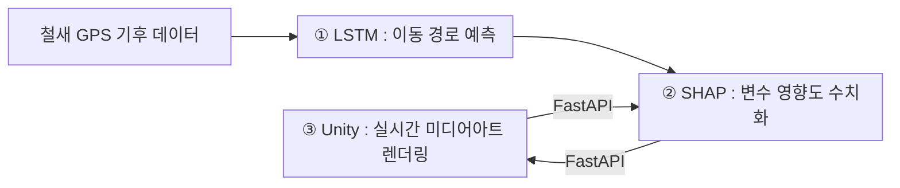

# 팀소개
## 연구 트랙 // 18팀 디바트(deep-art)
- **영상미술대학원생 2인**과 협업
- 철새를 소재로 한 **인터랙티브 미디어아트** 제작
- AI 추론 과정의 대중적 직접 체험

---

# 프로젝트 소개
## **"철새 이동 경로 예측 모델과 설명 가능한 AI(XAI)를 사용하여 전시 관람객에게 AI의 추론 과정에 대한 시각적 경험을 제공하는 인터랙티브 미디어아트 설치 작품"**

## 문제
**AI의 블랙박스**
- AI 응답 = 확률적 '가능성', 그러나 대중은 '정답'으로 인식
- 내부 추론 과정 불투명 → 비판적 수용 어려움

> 챗GPT의 답변을 복사하면서도, 왜 그 답이 나왔는지 모를 뿐더러 묻지 않습니다.

## 해결 아이디어
**XAI로의 접근, 그러나 대중과의 거리**
> ***`XAI` (Explainable AI, 설명가능한 AI)*** : AI 모델의 예측 결과에 대해 인간이 이해할 수 있는 근거와 설명을 제공하는 기술 및 방법론의 총칭

- AI 추론 과정을 설명하려는 시도로 발전한 분야
- 그러나 **여전히 전문가 영역에 한정** → 대중 접근성 부족
- 해결책: XAI를 **감각적 미디어아트**로 번역

## 기술
**철새 이동 경로 예측 + XAI 시각화 + 실시간 렌더링**

- 환경 변수(풍속, 풍향, 기류)에 따른 철새의 경로 결정
- 환경 변수의 변화에 따른 경로의 변화를 생생하게 시각화

**3단계 파이프라인:**

1. `LSTM` — 철새 GPS·기후 데이터 기반 이동 경로 예측
> ***`LSTM` (Long Short-Term Memory)*** : 데이터의 흐름과 순서를 학습해 다음 상태를 예측하는 AI 시계열 모델

2. `SHAP` — 각 변수가 예측 결과에 미친 영향도 수치화
> ***`SHAP` (SHapley Additive exPlanations)*** : AI 결과물에 각 변수가 얼마나 기여했는지를 수치로 보여주는 XAI 기법

3. `Unity` — 예측 경로·각 변수의 영향도를 실시간 미디어아트로 렌더링
> ***`Unity`*** : 게임·영상·설치미술 등 다양한 분야에서 쓰이는 크로스플랫폼 인터랙티브 엔진

## 차별성
**전문가 도구 → 대중적 감각 경험으로 확장**
- 영상예술대 대학원생 협업 → 예술적 완성도 확보
- SHAP 수치 결과 → 색·밝기 등 감각적 시각 표현으로 전환
- 관람객 실시간 인터랙션 → 비전공자도 AI 추론 과정 직관적 체험
- 이후 **전시 진행 예정**

---

# Related Work

## A Unified Approach to Interpreting Model Predictions
- SHAP: 게임 이론의 ***Shapley value*** 기반, 입력 feature별 예측 기여도 정량화 XAI 프레임워크
- 모델 종류 무관 → 일관된 feature importance 산출
- 복잡한 모델의 의사결정 수치적 설명의 표준 방법론
- **차별성**: 기여도 계산 결과를 수치 대신 색·밝기 등 감각적 시각 표현으로 전환, 실시간 인터랙션 결합 → 비전공자 직관적 체험 설계

## Bird Movement Prediction Using Long Short-Term Memory Networks to Prevent Bird Strikes with Low Altitude Aircraft
- 버드 스트라이크 방지 목적, LSTM으로 조류 GPS 궤적 학습 및 이동 경로 예측
- MoveBank 데이터 활용, 4종 LSTM 모델 구현·공항 시뮬레이션 검증
- LSTM의 시계열 조류 이동 데이터 유효성 실증
- 공유점: LSTM 아키텍처, MoveBank 데이터셋
- **차별성**: 예측 정확도 극대화 대신, 복수 후보 경로 시각화로 AI 예측의 확률적 속성 표출 → 실용 도구가 아닌 AI 동작 원리의 대중적 전달 목적

## 데이터와 인공지능이 만든 융합예술: 레픽 아나돌(Refik Anadol)의 작품 분석
- 레픽 아나돌 AI 미디어아트 분석 연구
- 핵심 사례: 〈Echoes of the Earth〉— XAI로 데이터 기여도 실시간 시각화 → 윤리적 투명성 구현
- 연구 전망: AI의 데이터 소유권 문제 해소, 예술·기술 융합의 사회적 문제 탐구 매체로의 진화
- 공유점: XAI 기반 미디어아트 형식
- **차별성**: XAI를 데이터 투명성 수단이 아닌 **작품 미학의 핵심**으로 활용, 관람객의 AI 예측 직접 개입 **인터랙티브 구조** 추가
